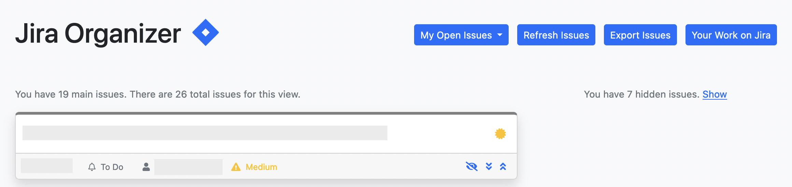

# Jira Organizer

Simple drag-and-drop organizer for Jira issues.

## Installation

Note: it's recommended to use a Python virtual environment. (`python -m venv .venv`)

1. Clone this repo.
2. Install required libraries with `pip install -r requirements.txt`.
3. Copy `jira_organizer/config-sample.py` to `jira_organizer/config.py` and update.
4. Run with `flask --app jira_organizer:app run`
5. Access from <http://localhost:5000>.

## Configuration

All configuration is stored in `jira_organizer.config`.

### `JIRA_SUBDOMAIN`

The subdomain of your organizations Jira site.

For example `acmeinc` is the subdomain for `https://acmeinc.atlassian.net/`.

### `JIRA_USERNAME`

Your Atlassian account username -- usually your e-mail.

### `JIRA_API_KEY`

A Personal Access Token (PAT) created from [here](https://id.atlassian.com/manage-profile/security/api-tokens).

### `JIRA_URL`

API endpoint for Jira. Automatically set if not defined. 

### `ISSUE_DEFAULT_STATUS_COLORS`

Dictionary of colors for each status where the key is sluggified status name and the value is the color.

You can override this in `ISSUE_VIEWS` with `status_colors`.

### `ISSUE_DEFAULT_PRIORITY_COLORS`

Dictionary of Bootstrap color classes for each priority where the key is the sluggified priority name and the class name.

Defaults to `danger` for `high` and `very_high`, `warning` for `medium`, and `primary` for `low` and `lowest`.

You can override this in `ISSUE_VIEWS` with `priority_colors`.

### `ISSUE_DEFAULT_OTHER_STATUSES`

List of sluggified status names to be shown in the Other column.

You can override this in `ISSUE_VIEWS` with `other_statuses`.

### `ISSUE_DEFAULT_DISPLAY_FLAGS`

Dictionary of display flags where the key is an option from below and the value is a boolean.

 * `show_status`: Shows the issue's status
 * `show_reporter`: Shows the name of the report (only on the main column)
 * `show_project`: Shows the project name (only on the main column)
 * `show_assignee`: Shows the assignee name (only on the main column)
 * `show_priority`: Shows the priority (only on the main column)

You can override this in `ISSUE_VIEWS` with `display_flags`.

### `ISSUE_VIEWS`

Dictionary of views where the key is the name of the view (no spaces) and the value is a dictionary of the options below.

 * `jql`: JQL for the view
 * `title`: Title to be shown
 * `display_flags`: See `ISSUE_DEFAULT_DISPLAY_FLAGS`
 * `other_statuses`: See `ISSUE_DEFAULT_OTHER_STATUSES`
 * `priority_colors`: See `ISSUE_DEFAULT_PRIORITY_COLORS`
 * `status_colors`: See `ISSUE_DEFAULT_STATUS_COLORS`

If no default view is specified, a view will be added for open issues of the current user.

### `ISSUE_DEFAULT_VIEW`

Name of the default view.

Defaults to `default`.

## To Do

 * ~~Caching~~
 * Add note to issue
 * ~~Move issue to top/bottom~~
 * ~~Export issues (for pasting into Slack)~~
 * Expanded view modal

## Release History

* `0.6` - Added auto refresh
* `0.5` - Added caching; refactored main view to use APIs
* `0.4` - Added multiple views; various cosmetic changes
* `0.3` - Added ability to hide issues; fixed issue with `Data` object; added priority display
* `0.2` - Added export view and ability to move issue to top/bottom
* `0.1` - Initial release
